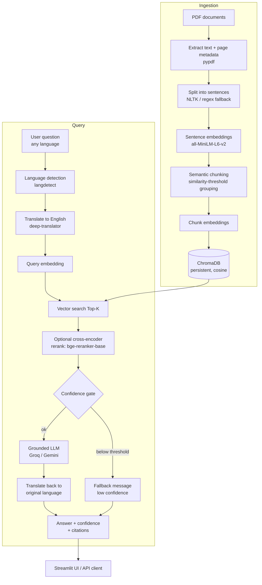

# Semantic RAG — Retrieval-Augmented Generation over PDFs

A production-ready **Retrieval-Augmented Generation** system that answers
questions **only** from your documents — never from unsupported knowledge. It
uses **semantic chunking**, `all-MiniLM-L6-v2` embeddings, **ChromaDB**, and an
LLM (**Groq Llama 3.3 70B** or **Google Gemini**), served through a **FastAPI**
backend and a **Streamlit** UI. It supports multilingual queries, citation-backed
answers, confidence scoring, hallucination prevention, and cross-document
contradiction detection.

---

## Table of contents

1. [Project overview](#project-overview)
2. [Architecture](#architecture)
3. [Folder structure](#folder-structure)
4. [Installation](#installation)
5. [Environment variables](#environment-variables)
6. [Quick start](#quick-start)
7. [Semantic chunking explained](#semantic-chunking-explained)
8. [Embedding model](#embedding-model)
9. [Vector database](#vector-database)
10. [Hallucination prevention](#hallucination-prevention)
11. [Multilingual support](#multilingual-support)
12. [API documentation](#api-documentation)
13. [Streamlit usage](#streamlit-usage)
14. [Evaluation methodology](#evaluation-methodology)
15. [Future improvements](#future-improvements)

---

## Project overview

Given a corpus of at least five substantial PDFs, the system:

- ingests documents, extracts per-page text, and splits it into **semantically
  coherent chunks** (not fixed-size windows);
- embeds every chunk with `sentence-transformers/all-MiniLM-L6-v2` and stores
  vectors + metadata in a **persistent ChromaDB** collection;
- answers questions via `POST /ask`: detect language → translate to English →
  retrieve Top-5 chunks → (optional rerank) → **grounded** LLM generation →
  translate back → return the answer with **citations**, a **confidence score**,
  and the raw retrieved chunks;
- refuses to hallucinate: if retrieval confidence is too low, or the context is
  insufficient, it returns a fixed fallback message instead of guessing;
- detects **contradictions** between two documents on a topic via
  `POST /contradict`;
- ships a **Streamlit** UI so the whole thing is usable without Postman.

---

## Architecture



If the diagram does not render, the pipeline in words is:
`PDF → text+pages → sentences → sentence embeddings → semantic chunks → chunk
embeddings → ChromaDB`, and at query time `question → detect language →
translate → embed → retrieve Top-K → (rerank) → confidence gate → grounded LLM →
translate back → answer + citations`.

---

## Folder structure

```
rag_app/
├── config.py                       # Central pydantic-settings configuration
├── requirements.txt
├── .env.example                    # Copy to .env and add your API key(s)
├── README.md
│
├── backend/
│   ├── main.py                     # FastAPI app (uvicorn backend.main:app)
│   ├── core/
│   │   ├── logging_config.py       # Central logging
│   │   └── exceptions.py           # Domain exceptions
│   ├── models/
│   │   └── schemas.py              # Pydantic request/response models
│   ├── modules/                    # Business logic (separate from routes)
│   │   ├── ingestion.py            # PDF loading, page metadata, sentence split
│   │   ├── chunking.py             # Semantic chunking
│   │   ├── embeddings.py           # Sentence-Transformers wrapper
│   │   ├── vectorstore.py          # ChromaDB persistent store
│   │   ├── retrieval.py            # Query embedding + search + rerank
│   │   ├── reranker.py             # Cross-encoder reranker (optional)
│   │   ├── llm.py                  # LangChain Groq/Gemini + grounded prompts
│   │   ├── translation.py          # Language detection + translation
│   │   ├── pipeline.py             # Ingestion orchestrator
│   │   ├── ask_service.py          # /ask business logic
│   │   └── contradiction.py        # /contradict business logic
│   └── routes/                     # Thin HTTP layer
│       ├── ask.py
│       ├── contradict.py
│       └── ingest.py               # /ingest, /documents, /health
│
├── frontend/
│   └── app.py                      # Streamlit UI
│
├── scripts/
│   ├── ingest_documents.py         # CLI ingestion
│   └── download_sample_docs.py     # Fetch 5 sample PDFs
│
├── evaluation/
│   ├── eval_dataset.json           # 12 Q/A pairs
│   └── evaluate.py                 # Top-1 / Top-3 / Recall@5 + report
│
└── data/
    ├── documents/                  # Put your PDFs here
    └── chroma/                     # Persistent vector store (auto-created)
```

---

## Installation

Requires **Python 3.11+**.

```bash
# 1. Clone / unzip the project, then from the project root:
python -m venv .venv
source .venv/bin/activate        # Windows: .venv\Scripts\activate

# 2. Install dependencies
pip install -r requirements.txt

# 3. Configure environment
cp .env.example .env
#    then edit .env and add your GROQ_API_KEY (or GOOGLE_API_KEY)
```

> The embedding model (`all-MiniLM-L6-v2`) and, if enabled, the reranker are
> downloaded automatically from Hugging Face on first use.

---

## Environment variables

All settings live in `.env` (see `.env.example`). The most important:

| Variable                              | Default                                  | Description                                       |
| ------------------------------------- | ---------------------------------------- | ------------------------------------------------- |
| `LLM_PROVIDER`                        | `groq`                                   | `groq` or `gemini`.                               |
| `GROQ_API_KEY`                        | —                                        | Required when provider is `groq`.                 |
| `GROQ_MODEL`                          | `llama-3.3-70b-versatile`                | Groq model name.                                  |
| `GOOGLE_API_KEY`                      | —                                        | Required when provider is `gemini`.               |
| `GEMINI_MODEL`                        | `gemini-1.5-flash`                       | Gemini model name.                                |
| `EMBEDDING_MODEL`                     | `sentence-transformers/all-MiniLM-L6-v2` | Embedding model.                                  |
| `CHROMA_PERSIST_DIR`                  | `./data/chroma`                          | Vector-store location.                            |
| `COLLECTION_NAME`                     | `rag_semantic_chunks`                    | Chroma collection.                                |
| `DOCUMENTS_DIR`                       | `./data/documents`                       | Where PDFs live.                                  |
| `SEMANTIC_SIMILARITY_THRESHOLD`       | `0.55`                                   | Topic-change boundary for chunking.               |
| `MAX_CHUNK_CHARS` / `MIN_CHUNK_CHARS` | `1200` / `120`                           | Chunk size guards.                                |
| `TOP_K`                               | `5`                                      | Chunks retrieved per query.                       |
| `USE_RERANKER`                        | `false`                                  | Enable the cross-encoder reranker.                |
| `RERANKER_MODEL`                      | `BAAI/bge-reranker-base`                 | Reranker model.                                   |
| `MIN_RETRIEVAL_SIMILARITY`            | `0.25`                                   | Below this, skip the LLM and return the fallback. |
| `HUMAN_REVIEW_THRESHOLD`              | `0.40`                                   | Below this, flag the answer for human review.     |
| `API_BASE_URL`                        | `http://localhost:8000`                  | Used by the Streamlit UI to reach the API.        |

---

## Quick start

```bash
# (Optional) grab five real sample papers to test with
python -m scripts.download_sample_docs

# Ingest all PDFs in data/documents (semantic chunking + embeddings + Chroma)
python -m scripts.ingest_documents

# Terminal 1 — start the API
uvicorn backend.main:app --reload --port 8000
#   Swagger docs at http://localhost:8000/docs

# Terminal 2 — start the UI
streamlit run frontend/app.py
#   UI at http://localhost:8501
```

You can also upload PDFs directly from the Streamlit sidebar — no CLI needed.

---

## Semantic chunking explained

Fixed-size and `RecursiveCharacterTextSplitter` chunking cut text at arbitrary
character counts, which frequently splits a single idea across two chunks or
mixes two unrelated ideas in one. That hurts retrieval: the vector for a
mixed/partial chunk is a blurry average that matches queries poorly.

**Semantic chunking** groups sentences by _meaning_ instead:

1. Extract text from each PDF page (preserving page numbers).
2. Split the text into sentences (NLTK Punkt, with a regex fallback for offline
   use).
3. Embed every sentence with `all-MiniLM-L6-v2` (normalised vectors).
4. Walk the sentence stream, keeping a running **centroid** of the current
   chunk's sentence embeddings.
5. Compare each next sentence to that centroid using **cosine similarity**. When
   the similarity drops below `SEMANTIC_SIMILARITY_THRESHOLD`, a topic change is
   detected → close the current chunk and start a new one.
6. Guard rails: `MAX_CHUNK_CHARS` prevents runaway chunks; tiny trailing chunks
   (< `MIN_CHUNK_CHARS`) are merged into their neighbour.
7. Each chunk is stored with its **source filename, page number(s), unique
   chunk id, and text**.

The result is that **complete ideas stay together**, so each chunk's embedding
is a cleaner semantic signal and retrieval quality improves.

---

## Embedding model

- **Model:** `sentence-transformers/all-MiniLM-L6-v2`
- **Dimensionality:** 384
- **Why:** small, fast, strong general-purpose semantic quality; runs on CPU.
- Vectors are **L2-normalised**, so dot product equals cosine similarity — used
  consistently for both the chunking decision and retrieval.

---

## Vector database

- **ChromaDB** with a **persistent** client (`CHROMA_PERSIST_DIR`).
- Collection uses **cosine** space (`hnsw:space=cosine`), so retrieval distance
  maps directly to a `similarity = 1 - distance` score in `[0, 1]`.
- Each record stores: the **embedding**, the **chunk text** (as the document),
  and **metadata** = `{source, page, page_start, page_end, chunk_id}`.
- Re-ingesting a file deletes its previous chunks first (idempotent updates).

---

## Hallucination prevention

Three independent safeguards:

1. **Grounded prompt.** The LLM is instructed to answer _only_ from the supplied
   context and to emit exactly:
   > "The provided documents do not contain enough information to answer this question."
   > when the context is insufficient. It also returns which passages it used, so
   > citations are real.
2. **Retrieval confidence gate.** If the best retrieval similarity is below
   `MIN_RETRIEVAL_SIMILARITY`, the LLM is **skipped entirely** and the fallback
   message is returned with a low confidence score.
3. **Human-in-the-loop.** When confidence is below `HUMAN_REVIEW_THRESHOLD`
   (default `0.40`), the response is flagged `needs_human_review = true` and the
   UI shows a warning.

---

## Multilingual support

Every `/ask` request runs: **detect language** (`langdetect`) → **translate to
English** (`deep-translator`) → retrieve → generate → **translate the answer
back** to the original language. The `detected_language` is returned in the
response, and the answer is always delivered in the user's language. If
translation is unavailable, the pipeline degrades gracefully to treating the
text as English rather than failing.

---

## API documentation

Interactive docs: **`http://localhost:8000/docs`**.

### `POST /ask`

**Request**

```json
{ "question": "What is semantic chunking and why is it used?" }
```

**Response**

```json
{
  "answer": "Semantic chunking groups related sentences into coherent chunks ...",
  "detected_language": "en",
  "confidence": 0.72,
  "needs_human_review": false,
  "citations": [
    {
      "source": "retrieval_augmented_generation.pdf",
      "page": 3,
      "chunk_id": "retrieval_augmented_generation::c0007::a1b2c3d4e5",
      "snippet": "We group semantically related sentences ...",
      "similarity": 0.72
    }
  ],
  "retrieved_chunks": [
    {
      "chunk_id": "...",
      "source": "...",
      "page": 3,
      "text": "...",
      "similarity": 0.72
    }
  ]
}
```

Optional fields: `top_k` (override retrieval depth) and `source_filter`
(restrict to one document).

### `POST /contradict`

**Request**

```json
{
  "document_1": "policy_v1.pdf",
  "document_2": "policy_v2.pdf",
  "topic": "remote work eligibility"
}
```

**Response**

```json
{
  "conflict": true,
  "reasoning": "Document 1 states remote work is allowed for all staff, while document 2 restricts it to senior employees.",
  "document_1": "policy_v1.pdf",
  "document_2": "policy_v2.pdf",
  "topic": "remote work eligibility",
  "citations_document_1": [
    {
      "source": "policy_v1.pdf",
      "page": 2,
      "chunk_id": "...",
      "snippet": "...",
      "similarity": 0.66
    }
  ],
  "citations_document_2": [
    {
      "source": "policy_v2.pdf",
      "page": 4,
      "chunk_id": "...",
      "snippet": "...",
      "similarity": 0.61
    }
  ]
}
```

### Other endpoints

| Method & path            | Purpose                                                 |
| ------------------------ | ------------------------------------------------------- |
| `POST /ingest`           | Upload one or more PDFs (multipart) and index them.     |
| `POST /ingest/directory` | Ingest every PDF already in `DOCUMENTS_DIR`.            |
| `GET /documents`         | List indexed documents and their chunk counts.          |
| `GET /health`            | Service status, provider, embedding model, chunk count. |

**Example — curl**

```bash
curl -X POST http://localhost:8000/ask \
     -H "Content-Type: application/json" \
     -d '{"question": "How does BERT pre-train language representations?"}'

curl -X POST http://localhost:8000/ingest \
     -F "files=@data/documents/bert.pdf"
```

---

## Streamlit usage

```bash
streamlit run frontend/app.py
```

The UI provides:

- **Sidebar:** backend health, PDF upload + ingest, and the list of indexed
  documents.
- **Ask tab:** question box (any language), optional per-document filter, the
  generated answer, **confidence** metric + progress bar, detected language,
  human-review flag, **expandable citations**, and the raw **retrieved semantic
  chunks**.
- **Contradiction Check tab:** pick two documents and a topic, get a
  conflict verdict, reasoning, and side-by-side citations.

Point the UI at a non-default backend with `API_BASE_URL=http://host:port`.

---

## Evaluation methodology

`evaluation/eval_dataset.json` contains **12 question/answer pairs**, each
labelled with the source document(s) that truly contain the answer (and
optional keywords). `evaluation/evaluate.py` runs retrieval for each question
and reports:

- **Top-1 Retrieval Accuracy** — the single best chunk comes from a relevant
  source document.
- **Top-3 Retrieval Accuracy** — at least one of the top-3 chunks is relevant.
- **Recall@5** — fraction of the expected relevant documents found in the top-5
  (averaged over questions).
- **Keyword hit-rate** — a content-level sanity check that expected terms appear
  in retrieved text.

```bash
# Ingest documents first, then:
python -m evaluation.evaluate
# Writes evaluation/evaluation_report.md and evaluation_report.json
```

If you use your own documents, edit `relevant_sources`/`keywords` in the dataset
to match them.

---

## Future improvements

- **Hybrid search** (BM25 + dense) for better keyword/entity recall.
- **Streaming responses** from the LLM for faster perceived latency.
- **Chunk-overlap / sliding context** across page boundaries for long ideas.
- **Answer-level faithfulness scoring** (e.g. NLI entailment between answer and
  cited chunks) on top of retrieval confidence.
- **Caching** of query embeddings and LLM responses.
- **Auth & rate limiting** for multi-user deployments, plus Dockerisation.
- **More eval metrics** (MRR, nDCG) and an LLM-graded answer-quality set.

---

## Code quality notes

- Modular architecture with business logic (`modules/`) separated from HTTP
  routes (`routes/`).
- Type hints and docstrings throughout; PEP 8 style.
- Central configuration via `pydantic-settings` and `.env` (no hard-coded
  secrets).
- Robust error handling with domain-specific exceptions and structured logging.
- Graceful degradation: missing NLTK data → regex splitter; translation failure
  → treat as English; reranker failure → fall back to vector scores.
